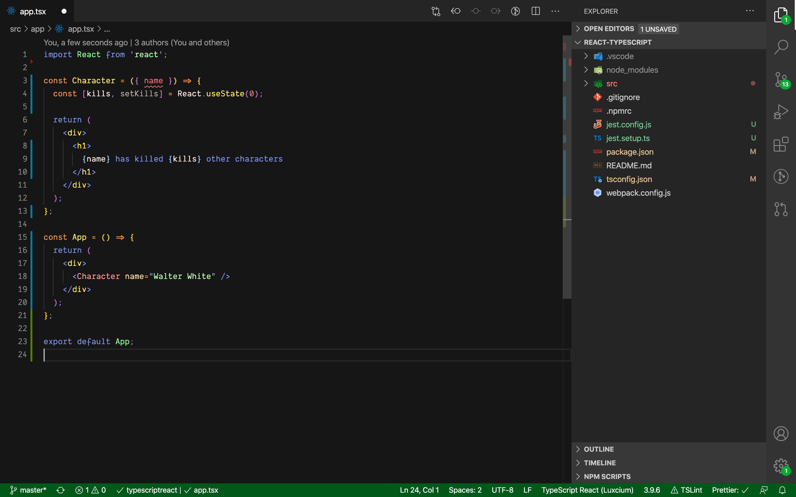
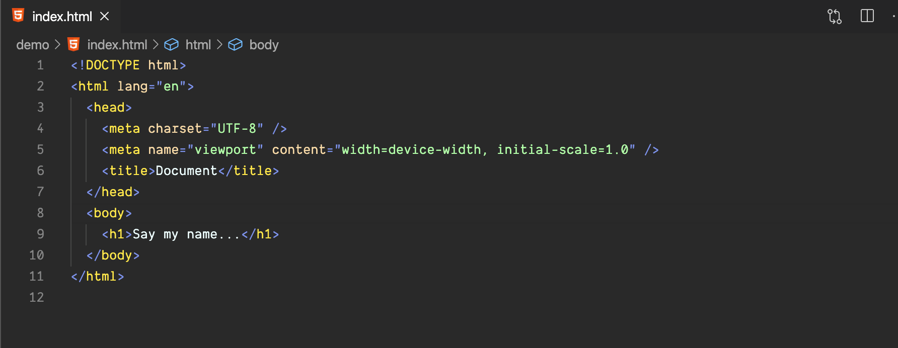
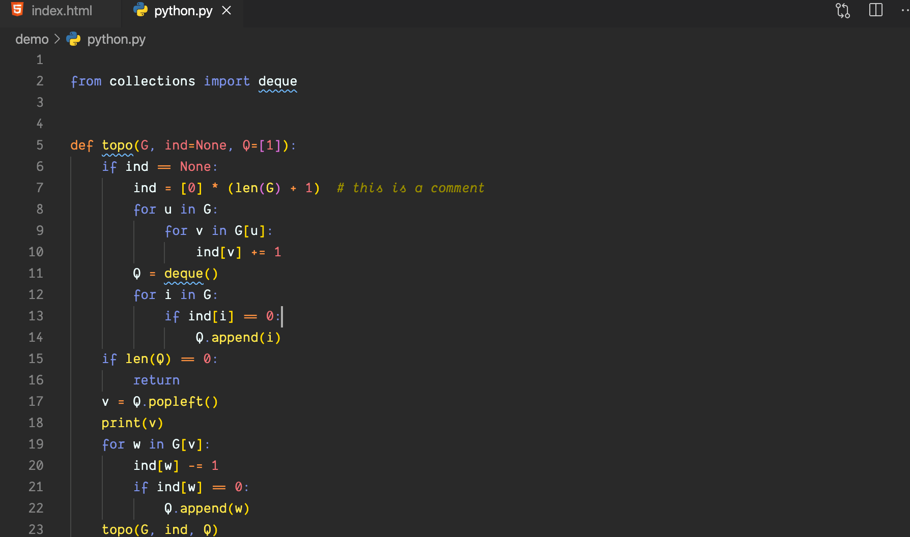

# 🧪 Heisenberg Theme for Visual Studio Code 💎

This is a color theme based on the classic TV show, "Breaking Bad".

🚨 Red - When characters in the series are wearing the color, it tends to connote aggression, violence, danger and murder.

🧡 Orange - the color used for warning and danger during the show. Often in the “Breaking Bad” series, orange clothing will be worn by characters or orange objects will be present in a scene right before something dangerous or deadly happens.

💛 Yellow - In the “Breaking Bad” series, yellow is most often associated directly with the meth cooking, selling and laundering operation. Yellow also signifies caution, which is taken more and more as Walt becomes more experienced in the meth business.

🧪💵 Green - Green serves as the personification of desperation, envy, and greed. Starting from the pilot of "Breaking Bad," Walt is seen wearing a green apron as he makes his first batch of meth. While he initially turned to meth cooking out of desperation to secure his family's future, it evolved into greed as he experienced the power and vast wealth his meth provided him.

💎 Blue - Blue serves multiple symbolic purposes. When objects are colored blue, they tend to signify purity, escape and security. The iconic blue meth Walt and Jesse cook was of the highest purity.

💜 Purple - Gilligan offered this explanation of the color purple in his interview with Vulture, “Well, Marie would say purple is the color of royalty.”

💖Pink - Well, Jesse Pinkman 😉

⚪️ White - Walter White 😎 White is often used in direct contrast with black. The White family lived on Negro Arroyo Lane. In Spanish this translates to, “black stream”. In the case of Walt, a dark path he is leading his family down.

⚫️ Black - Black represents several things throughout the series. Death, deception, nefariousness, evil, and power are all represented through it. One of the of signature uses of black in the “Breaking Bad” series is seen through the black hat Walt puts on at different times of the series. Every time he puts on the hat, he is affirming his power and scheming for a dark purpose.

Credits: [Breaking Bad color theory by Luke Villapaz](https://www.ibtimes.com/breaking-bad-color-theory-subtle-symbolism-meanings-behind-colors-amcs-hit-series-1411632)
